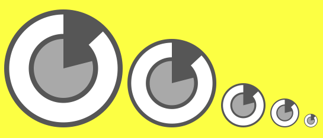
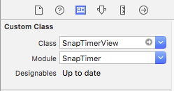
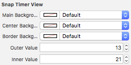

# SnapTimer

SnapTimer is a custom UIView that behaves exactly the same as the one on Snapchat's stories. 

[](https://travis-ci.org/andresinaka/SnapTimer) [](https://codecov.io/github/andresinaka/SnapTimer?branch=master)

## Features

- Two different timers, 'outer' and 'inner'.
- Independent animations for each of the timers.
- Customizable colors.
- Completion handlers.
- Fully Swift.

# What does it look like?

> A picture is worth a thousand words



# Installation

You can just clone the repo and copy the ```SnapTimer``` folder to your project or you can use one of the following options:
 
### Setting up with [CocoaPods](http://cocoapods.org/)

```
pod 'SnapTimer'
```

Then:

``` 
import SnapTimer
```

And you are all set! 

### Setting up with [Carthage](https://github.com/Carthage/Carthage)

- TODO

# How do I add it?

1. Add a `UIView` to your Storyboard.
2. Select the view, go to the `Identity Inspector` and set the class to `SnapTimerView`
 
    

3. Create an `@IBOutlet` in your view controller and that's it.
 
    `SnapTimerView` implements `@IBDesignable` so the view should automatically render in your Interface Builder. Also it implements `@IBInspectable` for the view properties:

   

4. That's it!

### Setting inner and outer values

**innerValue** and **outerValue** ranges go from 0 to 100.

* To set values without animations you just have to:

    ```swift
self.snapTimerView.outerValue = 25
self.snapTimerView.innerValue = 50
```
   

* To animate values:

    ```swift
self.snapTimerView.animateOuterValue(50)
self.snapTimerView.animateInnerValue(25)
```
   

* To animate values setting the time and a completion handler:

  ```swift
  self.snapTimerView.animateOuterToValue(50, duration: 30) {
	  puts("Done!")
  }
 
  self.snapTimerView.animateInnerToValue(100, duration: 30) {
	  puts("Done!")
  }
  ```
 
### Pausing and resuming animations:

if your app goes to background or the Notifications/Control center are opened you may want to pause the animations, to do that SnapTimer has two handy methods:

```swift
self.snapTimerView.resumeAnimation()
self.snapTimerView.pauseAnimation()
```

# Check the sample project!


# Cool ways to improve it?

Hey, If you have cool ideas to add to this please feel free to send a PR! Also if you are using this in your app and what to let me know I'll be happy to add a section here with the apps currently using this!

# Todo
* Swift 2.3 and 3 👌
